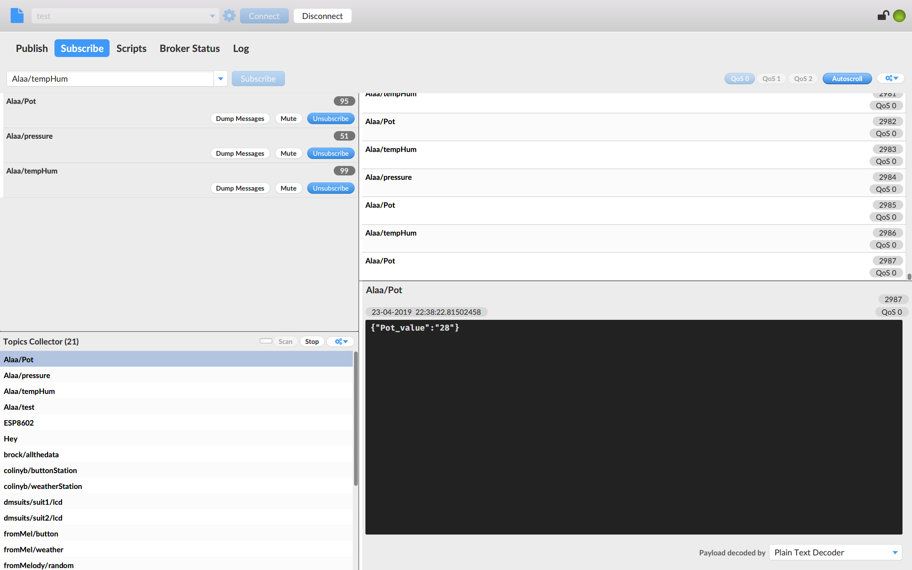
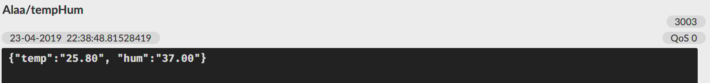
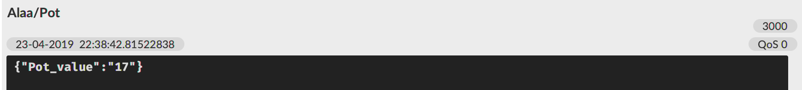

# ** A Weather Station   **
## PUBLISHING & SUBSCRIBING WEATHER DATA

This Program incorporates some sensors to build a weather station using the DHT22 and MPL115A2 sensors on a breadboard

## __Output__
If you followed all of the instructions, then your output should look a little something like this:

Individual sensor output displayed:

 

 
